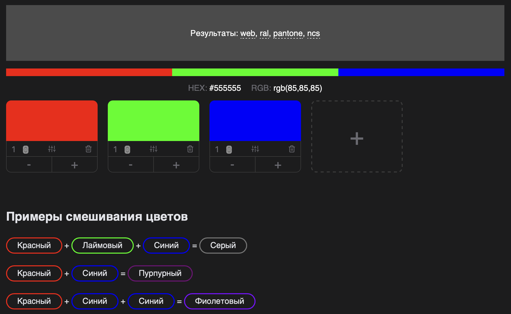

#  Get Color

- В базовом варианте предполагается смешивание двух цветов (например, красного и синего) для получения результата (например, фиолетового).
- При нажатии на окно с цветом, пользователю доступны либо системные цветовые палитры, либо изображения цветов из галереи. Важно отметить, что название цвета обязательно указывается над самим цветом, так как приложение поддерживает смену языка, и названия цветов могут изменяться.
- Добавь анимацию при выборе и смешивании цветов.
- Сделай поддержку горизонтальной ориентации.
- Добавь возможность смешивать три и более цвета.

